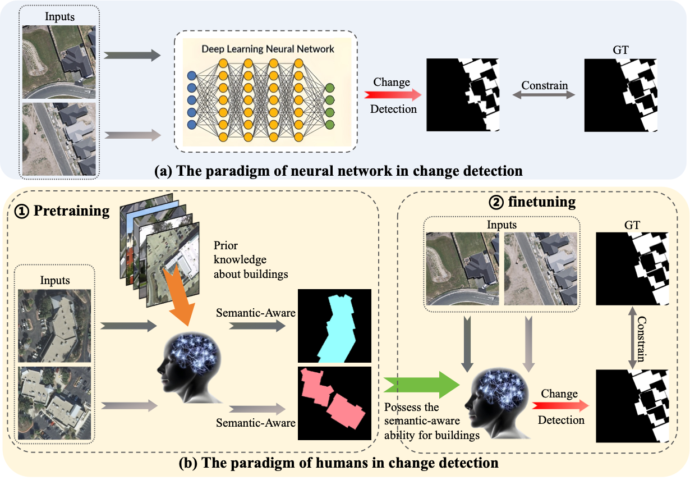
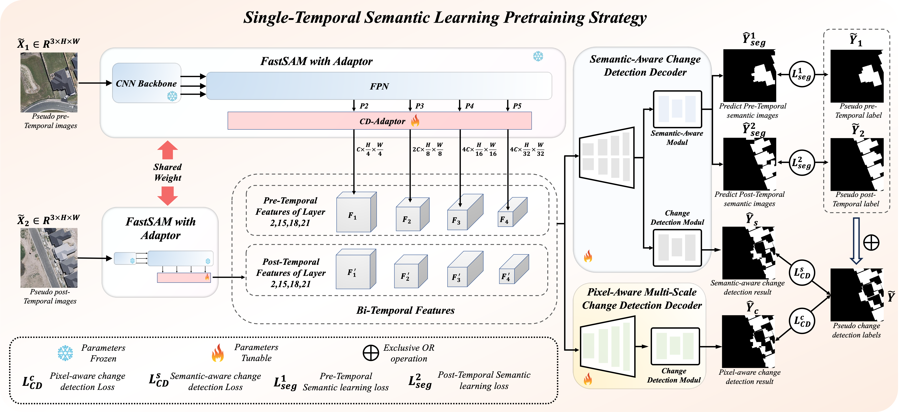
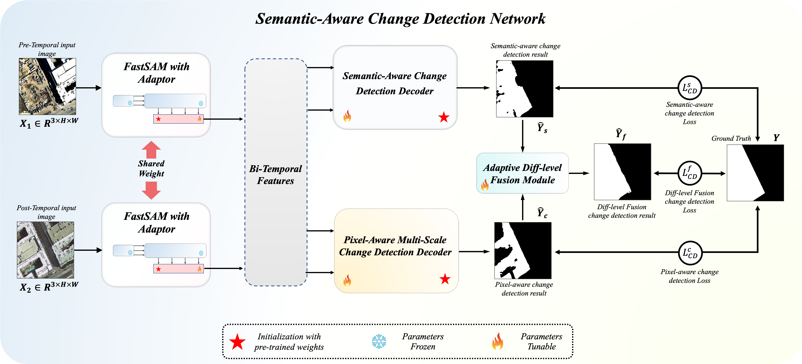

# SA-CD: Towards Advanced Change Detection: A Semantic-Aware Approach Inspired by Human Cognition

To train change detection models, researchers commonly use bi-temporal images captured at different times of the same region  as input, and employ corresponding change maps as training supervision signals. However, existing change detection methods primarily rely on pixel-aware change maps between bi-temporal images as constraints, deviating from human visual paradigm that emphasizes semantic understanding prior to change detection. This limitation undermines ability of model to perform effective change detection in the presence of pixel-level disturbances such as noise and illumination variations. We hypothesize that this stems from the model's lack of semantic awareness. To this end, we propose a change detection framework named Semantic-Aware Change Detection (SA-CD). Specifically, a Single-temporal Semantic Learning Pretraining (SSLP) strategy is introduced to enable the model to learn deep semantic feature representations and target change patterns from large-scale single-temporal remote sensing semantic segmentation data. Furthermore, we proposed a novel Semantic-Aware Change Detection Network (SANet),  which design two distinct decoders at both pixel-difference and object-semantic levels, enabling precise decoding of target changes from global structures to fine textures, thereby enhancing overall accuracy in change detection.
<!-- PROJECT SHIELDS -->

[![Contributors][contributors-shield]][contributors-url]
[![Forks][forks-shield]][forks-url]
[![Stargazers][stars-shield]][stars-url]
[![Issues][issues-shield]][issues-url]
[![MIT License][license-shield]][license-url]


<!-- PROJECT LOGO -->
<br />

<p align="center">
  <a href="https://github.com/thislzm/SA-CD/">
    
  </a>
  <h3 align="center">Motivation of our paper</h3>

<p align="center">
  <a href="https://github.com/thislzm/SA-CD/">
    
  </a>
  </p>
   
  <p align="center">
  <a href="https://github.com/thislzm/SA-CD/">
    
  </a>
  </p>

  <p align="center">
     Towards Advanced Change Detection: A Semantic-Aware Approach Inspired by Human Cognition
    <br />
    <a href="https://github.com/thislzm/SA-CD"><strong>Exploring the documentation for SA-CD »</strong></a>
    <br />
    <br />
    <a href="https://github.com/thislzm/SA-CD">Check Demo</a>
    ·
    <a href="https://github.com/thislzm/SA-CD/issues">Report Bug</a>
    ·
    <a href="https://github.com/thislzm/SA-CD/issues">Pull Request</a>
  </p>

</p>

## Filetree
```
SA-CD
├── checkpoints
│   ├── SANet
│   │   ├── LEVIR
│   │   │   ├── no_pretrain.pth
│   │   │   └── with_pretrain.pth
│   │   ├── LEVIR+
│   │   │   ├── no_pretrain.pth
│   │   │   └── with_pretrain.pth
│   │   ├── S2Looking
│   │   │   ├── no_pretrain.pth
│   │   │   └── with_pretrain.pth
│   │   ├── WHU
│   │   │   ├── no_pretrain.pth
│   │   │   └── with_pretrain.pth
│   │   └── WHU_CUL
│   │       ├── no_pretrain.pth
│   │       └── with_pretrain.pth
│   └── pre_train
│       ├── Building
│       │   └── pretrain_Building.pth
│       └── Cultivalted land
│           └── pretrain_cultivalted.pth
├── datasets
│   ├── Levir_CD.py
│   ├── Levir_CD2.py
│   ├── data_utils.py
│   ├── data_utils2.py
│   ├── pre_CD.py
│   ├── pre_CD2.py
│   └── pre_CD3.py
├── fastsam_model
│   ├── FastSAM-s.pt
│   └── FastSAM-x.pt
├── models
│   ├── FastSAM
│   ├── SAM_Fusion2.py
│   └── preSAM_SNUNet4.py
├── pretrain.py
├── train.py
├── eval.py
├── ultralytics
└── utils
    ├── __init__.py
    ├── crf.py
    ├── data_vis.py
    ├── eval.py
    ├── load.py
    ├── loss.py
    ├── metric_tool.py
    ├── metrics.py
    ├── misc.py
    ├── transform.py
    └── utils.py
```
---

## Contents
1. [Dataset Formats](#dataset-formats)
   - [Pretraining Phase: Semantic Segmentation Dataset Format](#pretraining-phase-semantic-segmentation-dataset-format)
   - [Fine-Tuning Phase: Change Detection Dataset Format](#fine-tuning-phase-change-detection-dataset-format)
2. [Pretrained Weights and Datasets](#pretrained-weights-and-datasets)
3. [Model Loading Instructions](#model-loading-instructions)
4. [Pretraining Phase Instructions](#pretraining-phase-instructions)
   - [Loading Pretraining Datasets](#loading-pretraining-datasets)
   - [Saving Pretrained Models](#saving-pretrained-models)
5. [Fine-Tuning Phase Instructions](#fine-tuning-phase-instructions)
   - [Loading Datasets](#loading-datasets)
   - [Training](#training)
   - [Validation](#validation)
6. [Performance Metrics on Public Change Detection Datasets](#performance-metrics-on-public-change-detection-datasets)
7. [Visualization Results](#visualization-results)

---

## Dataset Formats

### Pretraining Phase: Semantic Segmentation Dataset Format
- **Structure:**
  - `data_name`: Input images
  - `A`: Semantic segmentation input image
  - `Label`: Corresponding segmentation labels

### Fine-Tuning Phase: Change Detection Dataset Format
- **Structure:**
  - `data_name`
    - `train`
      - `A`: Image at time T1
      - `B`: Image at time T2
      - `label`: Ground truth change map
    - `val`
      - `A`, `B`, `label`: Validation dataset
    - `test`
      - `A`, `B`, `label`: Test dataset

---

## Pretrained Weights and Datasets
### Download Link of Pretrained weights 
- Download our FastSAM weights on Baidu cloud disk: https://pan.baidu.com/s/1lS3gPNU6FkTY3uFEAj_ITA?pwd=lzms
- Download our pre_train weights on Baidu cloud disk: https://pan.baidu.com/s/1otiGilbOmgzeATVerx7LSQ?pwd=lzms
- Download our SANet weights on Baidu cloud disk: https://pan.baidu.com/s/1JrX2jMrJIQJniEg2w0-sog?pwd=lzms
### Download Link of Change Detection Datasets
- Download LEVIR Dataset on Baidu cloud disk: https://pan.baidu.com/s/11W6Obog_mQm6kXfwfpuKDQ?pwd=lzms
- Download LEVIR+ Dataset on Baidu cloud disk: https://pan.baidu.com/s/1IRfqsIka7PpHEiGWkTh01Q?pwd=lzms
- Download S2Looking Dataset on Baidu cloud disk: https://pan.baidu.com/s/1UT1weZqiUgjdg68yuAgSJQ?pwd=lzms
- Download WHU-CD Dataset on Baidu cloud disk: https://pan.baidu.com/s/1g2y2wYnx7OIjIkARu5eAfg?pwd=lzms
- Download WHU Cultivate Land Dataset on Baidu cloud disk: https://pan.baidu.com/s/1lIooiYua3wwe4ec-9Zs7Wg?pwd=lzms
### Download Link of Semantic Segmentation Datasets
- Download WHU-Building Dataset on Baidu cloud disk: https://pan.baidu.com/s/1qnrWS-0UfVlsSJpPpAodIQ?pwd=lzms
- Download INRIA-Building Dataset on Baidu cloud disk: https://pan.baidu.com/s/1f1Q1PnjEQp3PtxlkCNFTgg?pwd=lzms
- Download LoveDA Dataset on PaddlePaddle: https://aistudio.baidu.com/datasetdetail/55681
- Download DLCCC Dataset on PaddlePaddle: https://aistudio.baidu.com/datasetdetail/55681
- Download AIRS Dataset on PaddlePaddle: https://aistudio.baidu.com/datasetdetail/74274
---

## Model Loading Instructions
- Update the <a href="https://pan.baidu.com/s/1lS3gPNU6FkTY3uFEAj_ITA?pwd=lzms"> FastSAM <a> model path in the following scripts:
  - `/models/preSAM_SUNNet4.py`: Line 235
  - `/models/SAM_Fusion2.py`: Line 160

---

## Pretraining Phase Instructions

### Loading Pretraining Datasets
1. **Single Dataset**:  

   Modify the dataset path in `/datasets/pre_CD.py` at line 16:  
   ```python
   root = "<path_to_pretraining_dataset>"
   ```
3. **Two Datasets**:

    Modify the paths in `/datasets/pre_CD2.py` at line 16:
   ```python
   root1 = "<path_to_first_dataset>"
   root2 = "<path_to_second_dataset>"
   ```
4. **Three Datasets**:

   Modify the paths in `/datasets/pre_CD3.py` at line 16:
   ```python
   root1 = "<path_to_first_dataset>"
   root2 = "<path_to_second_dataset>"
   root3 = "<path_to_third_dataset>"
   ```
### Saving Pretrained Models
**Update the model save directory in /pretrain.py**:  
  - Line 19 and Line 22.

---

## Fine-Tuning Phase Instructions

### Loading Datasets
**Update the dataset path in `/datasets/Levir_CD.py` at line 16**:
  ```python 
  root = "<path_to_dataset>"
  ```
### Training
- Configure the following parameters in /train.py:
- Model save path: Line 19 and Line 22.
- Pretrained model loading: Line 30, load_premodel.
- Pretrained model path: Line 42, chkpt_path.

### Validation
- Configure the following parameters in /eval.py:
- Model save path: Line 19 and Line 22.
- Model name for validation: Line 38, chkpt_path.

---

## Performance Metrics on Public Change Detection Datasets

The performance of the proposed method is evaluated with and without pretraining on multiple public datasets. Results are presented in terms of Precision (P), Recall (R), and F1-Score (F1).

<table>
  <tr>
    <td colspan="1" rowspan="1">Datasets</td>
    <td colspan="1" rowspan="1">Methods</td>
    <td colspan="1" rowspan="1">P(%)</td>
    <td colspan="1" rowspan="1">R(%)</td>
    <td colspan="1" rowspan="1">F1(%)</td>
  </tr>
  <tr>
    <td colspan="1" rowspan="2">LEVIR</td>
    <td colspan="1" rowspan="1">SA - CD w/o pretrain</td>
    <td colspan="1" rowspan="1">92.69</td>
    <td colspan="1" rowspan="1">89.66</td>
    <td colspan="1" rowspan="1">91.15</td>
  </tr>
  <tr>
    <td colspan="1" rowspan="1">SA - CD w/ pretrain</td>
    <td colspan="1" rowspan="1">91.77</td>
    <td colspan="1" rowspan="1">91.28</td>
    <td colspan="1" rowspan="1">91.53</td>
  </tr>
  <tr>
    <td colspan="1" rowspan="2">LEVIR +</td>
    <td colspan="1" rowspan="1">SA - CD w/o pretrain</td>
    <td colspan="1" rowspan="1">86.88</td>
    <td colspan="1" rowspan="1">79.15</td>
    <td colspan="1" rowspan="1">82.83</td>
  </tr>
  <tr>
    <td colspan="1" rowspan="1">SA - CD w/ pretrain</td>
    <td colspan="1" rowspan="1">85.55</td>
    <td colspan="1" rowspan="1">83.44</td>
    <td colspan="1" rowspan="1">84.43</td>
  </tr>
  <tr>
    <td colspan="1" rowspan="2">S2Looking</td>
    <td colspan="1" rowspan="1">SA - CD w/o pretrain</td>
    <td colspan="1" rowspan="1">81.25</td>
    <td colspan="1" rowspan="1">54.73</td>
    <td colspan="1" rowspan="1">65.40</td>
  </tr>
  <tr>
    <td colspan="1" rowspan="1">SA - CD w/ pretrain</td>
    <td colspan="1" rowspan="1">81.28</td>
    <td colspan="1" rowspan="1">56.24</td>
    <td colspan="1" rowspan="1">66.48</td>
  </tr>
  <tr>
    <td colspan="1" rowspan="2">WHU</td>
    <td colspan="1" rowspan="1">SA - CD w/o pretrain</td>
    <td colspan="1" rowspan="1">94.66</td>
    <td colspan="1" rowspan="1">91.22</td>
    <td colspan="1" rowspan="1">92.91</td>
  </tr>
  <tr>
    <td colspan="1" rowspan="1">SA - CD w/ pretrain</td>
    <td colspan="1" rowspan="1">95.29</td>
    <td colspan="1" rowspan="1">93.67</td>
    <td colspan="1" rowspan="1">94.47</td>
  </tr>
  <tr>
    <td colspan="1" rowspan="2">WHU Cultivate Land</td>
    <td colspan="1" rowspan="1">SA - CD w/o pretrain</td>
    <td colspan="1" rowspan="1">72.65</td>
    <td colspan="1" rowspan="1">73.93</td>
    <td colspan="1" rowspan="1">73.28</td>
  </tr>
  <tr>
    <td colspan="1" rowspan="1">SA - CD w/ pretrain</td>
    <td colspan="1" rowspan="1">77.74</td>
    <td colspan="1" rowspan="1">72.82</td>
    <td colspan="1" rowspan="1">75.20</td>
  </tr>
</table>

---

## Visualization Results

### Visual Results on LEVIR Datasets

<div style="text-align: center">

</div>

### Visual Results on LEVIR+ Datasets

<div style="text-align: center">

</div>

### Visual Results on S2Looking Datasets

<div style="text-align: center">

</div>

### Visual Results on WHU Datasets

<div style="text-align: center">

</div>

### Visual Results on WHU Cultivate Land Datasets

<div style="text-align: center">

</div>

<!-- links -->
[your-project-path]:thislzm/SA-CD
[contributors-shield]: https://img.shields.io/github/contributors/thislzm/SA-CD.svg?style=flat-square
[contributors-url]: https://github.com/thislzm/SA-CD/graphs/contributors
[forks-shield]: https://img.shields.io/github/forks/thislzm/SA-CD.svg?style=flat-square
[forks-url]: https://github.com/thislzm/SA-CD/network/members
[stars-shield]: https://img.shields.io/github/stars/thislzm/SA-CD.svg?style=flat-square
[stars-url]: https://github.com/thislzm/SA-CD/stargazers
[issues-shield]: https://img.shields.io/github/issues/thislzm/SA-CD.svg?style=flat-square
[issues-url]: https://img.shields.io/github/issues/thislzm/SA-CD.svg
[license-shield]: https://img.shields.io/github/license/thislzm/SA-CD.svg?style=flat-square
[license-url]: https://github.com/thislzm/SA-CD/blob/master/LICENSE.txt
[linkedin-shield]: https://img.shields.io/badge/-LinkedIn-black.svg?style=flat-square&logo=linkedin&colorB=555
[linkedin-url]: https://linkedin.com/in/shaojintian

